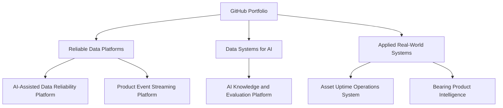

# Sourav Khandai

## Data Engineer | Reliable Data Platforms | AI-Ready Data Systems | Applied Operational Intelligence

I design reliable data systems that turn business and operational requirements into tested pipelines, trusted data products, AI-ready datasets, and human-controlled automation.

I am primarily a Data Engineer, working across pipelines, platform design, reliability, DevOps, and AI-assisted workflows. My mechanical engineering and manufacturing background is a domain advantage for understanding assets, maintenance, operations, reliability, and physical systems. I use AI to reduce repetitive investigation and decision-preparation work—not to bypass human accountability.

**Explore:** [Projects](projects.md) · [Strategy](docs/portfolio_strategy.md) · [Project README template](docs/project_readme_template.md) · [Manifest](portfolio_manifest.yaml)

## Engineering approach

I start with the decision or operational problem, make constraints explicit, and design for validation, recovery, and accountability. AI may organize evidence or prepare recommendations; a person remains responsible for consequential decisions and recovery actions.

## What I focus on

### Reliable Data Platforms

Python and SQL; ETL/ELT; batch and streaming; data modeling; CDC and incremental processing; data contracts; quality, observability, reconciliation, and backfills; APIs; Docker and CI/CD.

### Data Systems for AI

RAG ingestion and metadata; evaluation datasets; feature and embedding pipelines; prompt, model, and data versioning; agent evaluation; guardrails; and explicit human-approval boundaries.

### Applied Real-World Systems

Asset uptime; operational excellence; industrial operations; reliability and maintenance; product and market intelligence; economic-impact analysis; and business decision support.

## Featured projects

Status reflects evidence currently tracked here. A project brief is not presented as a finished implementation.

| Project | Problem solved | Core engineering evidence | AI role | Status |
|---|---|---|---|---|
| AI-Assisted Data Reliability Platform | Pipeline failures, stale data, schema drift, and manual recovery | Roadmap: ingestion, contracts, quality, observability, reconciliation | Proposed triage with human-approved recovery | Planned |
| AI Knowledge and Evaluation Platform | Unreliable ingestion, retrieval, and evaluation | Roadmap: ingestion, metadata, lineage, evaluation datasets | Proposed retrieval and evaluation support with human review | Planned |
| Asset Uptime Operations System | Manual maintenance investigation and decision preparation | Roadmap: asset events, reliability KPIs, impact analysis | Proposed recommendations subject to operator approval | Planned |
| Product Event Streaming Platform | Product-event processing for behavior analysis | Roadmap: event models, streaming, deduplication, late events | No autonomous decision role planned | Planned |
| Bearing Product Intelligence | Disconnected engineering, quality, service, and market information | Roadmap: product model, feedback loops, opportunity scoring | Proposed evidence synthesis for human decisions | Planned |
| [Health-Aware Autonomous Drone System](projects/Real-Time-Failure.md) | Routing that accounts for component condition and mission risk | Brief: health monitoring, risk assessment, adaptive routing | Proposed decision support; operators retain responsibility | In Development |

Additional work: [bearing RUL prediction](projects/rul-bearing.md), [robotic fleet optimization](projects/health-aware-robotic-fleet-optimization.md), [manufacturing root-cause analysis](projects/manufacturing-root-cause-analysis.md), and [real-time constraint optimization](projects/real-time-constraint-optimization.md).

## Current flagship project

### [Health-Aware Autonomous Drone System](projects/Real-Time-Failure.md) — In Development

The project explores route planning using motor and bearing condition alongside navigation and mission constraints. Current evidence is a design brief covering monitoring, risk assessment, and adaptive strategies. Analytics or AI is intended to prepare risk-informed options; mission and maintenance decisions remain with human operators. Implementation, tests, and performance results are not yet documented here.

## Core capabilities

| Area | Working knowledge and active roadmap |
|---|---|
| Data Engineering | Python, SQL, Pandas, PostgreSQL, APIs, ETL/ELT, Parquet, batch and streaming concepts |
| Reliability and Platform Engineering | Data contracts, quality, reconciliation, schema evolution, observability, backfills, Docker, CI/CD, testing |
| AI Data Engineering | RAG pipelines, evaluation data, version tracking, agent workflows, guardrails, human-in-the-loop systems |
| Business and Domain | Operational excellence, asset reliability, manufacturing, product analytics, economic impact, stakeholder requirements |

These combine documented exploration with an active learning roadmap; they are not claims of production deployment.

## Current work

**Currently building:** [Health-Aware Autonomous Drone System](projects/Real-Time-Failure.md) 
**Current milestone:** Convert the concept into explicit requirements, data contracts, and an architecture baseline. 
**Next:** Add a minimal, tested ingestion and health-scoring workflow before claiming implementation results.

## Portfolio navigation

- Core Data Engineering and reliability: **AI-Assisted Data Reliability Platform** — Planned
- AI data infrastructure: **AI Knowledge and Evaluation Platform** — Planned
- Applied operational systems: **Asset Uptime Operations System** — Planned
- Product and event data: **Product Event Streaming Platform** — Planned
- Industrial product intelligence: **Bearing Product Intelligence** — Planned
- Current documented work: [Project index](projects.md)

## Contact

- [LinkedIn](https://www.linkedin.com/in/sourav-khandai-75022b144/)
- [Email](mailto:khandai.sourav111@gmail.com)
- [Portfolio website](https://souravkh-7.github.io/git_portfolio/)

A resume link will be added when a public resume file is available.
