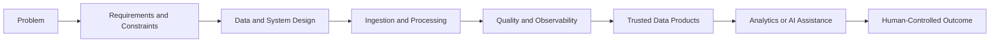

# Sourav Khandai - Data Engineering Portfolio

## Data Engineer | Reliable Data Platforms | AI-Ready Data Systems | Applied Operational Intelligence

I build reliable, observable, and AI-ready data systems that transform raw operational and business data into trusted data products, measurable workflows, and human-controlled decision support.

This repository is the home of my [GitHub Pages portfolio](https://SouravKh-7.github.io/git_portfolio/) and the map connecting my work in data reliability, pipeline optimization, industrial intelligence, business data products, and operations research.

## Start Here

- **Primary flagship:** [AI-Assisted Data Reliability Platform](https://github.com/SouravKh-7/ai-data-reliability-platform) - Reference Implementation
- **Core engineering case study:** [Data Pipeline Optimization Framework](https://github.com/SouravKh-7/data-pipeline-optimization-framework) - Active Development
- **Industrial-domain flagship:** [Industrial Service Intelligence Platform](https://github.com/SouravKh-7/industrial-service-intelligence-platform) - Active Development
- **Research track:** [Health-Aware Robotic Fleet Optimization System](https://github.com/SouravKh-7/Health-Aware-Robotic-Fleet-Optimization-System) - Design / Blueprint

## Portfolio Navigation

- [Projects](projects.md)
- [Project ecosystem](ecosystem.md)
- [Roadmap](roadmap.md)
- [About](about.md)
- [Portfolio restructuring plan](docs/portfolio-restructure-plan.md)

## Engineering Approach

Deterministic engineering, testable behavior, data quality, and observability come first. AI may help collect evidence, summarize findings, or prepare recommendations, but it does not bypass operational controls or human accountability.

## Evidence Policy

Project statuses describe evidence, not ambition. A reference implementation runs locally with tests and documented limitations. Active projects still have significant milestones. Design, parked, evolving, and archived work is labeled explicitly and is not presented as completed software.

## Contact

- [GitHub](https://github.com/SouravKh-7)
- [LinkedIn](https://www.linkedin.com/in/sourav-khandai-75022b144/)
- [Email](mailto:khandai.sourav111@gmail.com)
