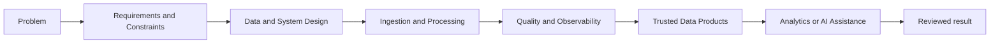

# Sourav Khandai — Data Engineer

## Data Engineering | Databricks | PySpark | SQL | Delta Lake | Lakehouse Architecture

I build data pipelines for manufacturing, retail, and operational work using Python, SQL, PySpark, Databricks, and Delta Lake. Most projects here are about data quality, maintenance records, incident investigation, or supply-chain data.

## About

My manufacturing and process-engineering background helps me understand the operational context behind the data: machines, maintenance, service activity, quality, reliability, constraints, and the cost of incomplete information. This portfolio shows how I am combining that domain knowledge with Data Engineering.

## Portfolio Scope

The [portfolio website](https://SouravKh-7.github.io/git_portfolio/) centers on three resume projects. Supporting projects, legacy experiments, and research blueprints remain visible with evidence-based status labels.

## Featured Resume Projects

### 1. [Machine Maintenance and Uptime Data Pipeline](https://github.com/SouravKh-7/manufacturing-asset-lifecycle-platform)

**Status:** ACTIVE BUILD — Local maintenance-data pipeline demonstrated; Databricks is a planned next phase.

The current Python and CSV implementation validates synthetic machine, telemetry, and maintenance data, quarantines invalid rows, calculates condition and reliability measures, and builds a combined machine summary and maintenance-priority file. Databricks, Delta Lake, CDC, SCD Type 2, production observability, and ML remain roadmap work.

### 2. [Production Incident AI Assistant](https://github.com/SouravKh-7/production-incident-ai-assistant)

**Status:** NEW BUILD / ACTIVE DEVELOPMENT

A new project for collecting alerts, logs, metrics, traces, deployments, pipeline failures, and runbooks in one incident view. The repository currently has design notes, source contracts, one test, and a Python scaffold. The working investigation flow and assistant are not built yet.

### 3. [Manufacturing & Retail Supply Chain Lakehouse](https://github.com/SouravKh-7/manufacturing-retail-supply-chain-lakehouse)

**Status:** NEW BUILD / ACTIVE DEVELOPMENT

A planned Databricks, PySpark, and Delta Lake project for manufacturing, supplier, warehouse, inventory, sales, and return data. The repository has contracts and design notes for CDC, late data, backfills, SCD Type 2, quality checks, and reconciliation. The pipeline is not built yet.

## Supporting Data Engineering Projects

Other projects cover data reliability, pipeline performance, and service-data reporting: [AI-Assisted Data Reliability Platform](https://github.com/SouravKh-7/ai-data-reliability-platform), [Data Pipeline Optimization Framework](https://github.com/SouravKh-7/data-pipeline-optimization-framework), and [Industrial Service Intelligence Platform](https://github.com/SouravKh-7/industrial-service-intelligence-platform).

## Research Track

The [Health-Aware Robotic Fleet Optimization System](https://github.com/SouravKh-7/Health-Aware-Robotic-Fleet-Optimization-System) and related drone, digital-twin, physical-AI, spatial-intelligence, and enterprise-context work form a secondary research track alongside the core Data Engineering portfolio.

## Portfolio Structure

- [Projects](projects.md)
- [Research notes and project stories](blog/index.html)
- [Enterprise Context & Organizational Memory Lab](projects/enterprise-context-memory.html)
- [Project ecosystem](ecosystem.md)
- [Project status matrix](docs/project-sync.md)
- [Resume-ready selected projects](docs/resume-projects.md)
- [Roadmap](roadmap.md)
- [About my background and engineering interests](about.md)

## Engineering Approach

The engineering process begins with the operating problem, intended consumer, and constraints. Data flow, validation, recovery, and observability come before analytics or AI. AI may collect evidence, summarize findings, or prepare recommendations, but it does not bypass operational controls or human accountability.

## Evidence Policy

Project statuses describe evidence, not ambition. A **Reference Implementation** runs locally with documented behavior, tests, and limitations. **Active Build** identifies an early local implementation with major phases still open. **New Build / Active Development** identifies an architecture and source-contract scaffold rather than an end-to-end system. Research, parked, legacy, and archived work remains visible without being presented as completed software.
