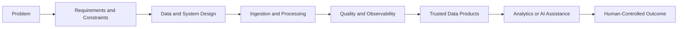

# Sourav Khandai - Data Engineering Portfolio

## Data Engineer | Reliable Data Platforms | AI-Ready Data Systems | Applied Operational Intelligence

I build data systems that turn raw operational and business data into information people can trust and use. My work focuses on reliable pipelines, data quality, observability, AI-ready data, and decision-support workflows that keep people accountable for important actions.

My manufacturing and process-engineering background helps me understand the operational context behind the data: machines, maintenance, service activity, quality, reliability, constraints, and the cost of incomplete information. This portfolio shows how I am combining that domain knowledge with Data Engineering.

## For Recruiters and Hiring Managers

If you arrived here from my resume, the best starting point is the [portfolio website](https://SouravKh-7.github.io/git_portfolio/). It provides a short guided view of the projects, their relationships, and their actual evidence level.

For a direct technical review, begin with the [AI-Assisted Data Reliability Platform](https://github.com/SouravKh-7/ai-data-reliability-platform). It is the strongest implementation in the portfolio and demonstrates the way I approach ingestion, validation, data contracts, quarantine, transformations, reconciliation, testing, APIs, operational evidence, and controlled AI assistance.

The portfolio is intentionally organized around three priority projects. Other repositories are supporting research, parked ideas, or earlier concepts and are labeled accordingly.

## Priority Projects

### 1. [AI-Assisted Data Reliability Platform](https://github.com/SouravKh-7/ai-data-reliability-platform)

**Status:** Reference Implementation | **Role:** Primary flagship

A data pipeline can finish without errors and still deliver incorrect or incomplete data. This project explores that gap through a runnable local system that ingests sample operational data, applies contracts and business rules, quarantines invalid records, builds analytical data products, reconciles results, detects incidents, and exposes evidence through an API.

The AI-assisted incident workflow is deliberately constrained. Deterministic code establishes the evidence, impact, allowed actions, and approval requirements. An optional model may improve an explanation, but it cannot invent evidence or authorize a risky action. The repository includes source code, tests, Docker configuration, CI, architecture notes, security boundaries, and local run instructions. It is a reference implementation, not a deployed production system.

### 2. [Data Pipeline Optimization Framework](https://github.com/SouravKh-7/data-pipeline-optimization-framework)

**Status:** Active Development | **Role:** Core engineering case study

This project is being developed as a measurable before-and-after study of pipeline improvement. Its purpose is to show not only that a pipeline was changed, but whether the change preserved correctness and produced a measurable benefit. The planned comparison covers incremental loading, Parquet, partitioning, data-quality checks, reconciliation, runtime monitoring, and reproducible benchmarks.

The project does not claim performance gains before measurements are available. Its next important milestone is a documented baseline and a repeatable benchmark that makes the trade-offs visible.

### 3. [Industrial Service Intelligence Platform](https://github.com/SouravKh-7/industrial-service-intelligence-platform)

**Status:** Active Development | **Role:** Industrial-domain flagship

Industrial after-sales decisions often depend on data spread across machines, customers, dealers, service visits, warranty claims, maintenance history, and spare parts. This project brings those sources into a coherent data platform so that service and reliability questions can be answered from validated, traceable data.

It is where my Data Engineering work connects most directly with my manufacturing background. The target is a practical MVP with clear industrial data models, quality controls, service KPIs, business-impact views, and decision-support outputs. The earlier Manufacturing Root-Cause Analysis Assistant is being incorporated as a module rather than promoted as a separate flagship.

## Research Track

The [Health-Aware Robotic Fleet Optimization System](https://github.com/SouravKh-7/Health-Aware-Robotic-Fleet-Optimization-System) is a **Design / Blueprint** project exploring scheduling and routing under robot health, battery, capacity, availability, and conflict constraints. It represents my research interest in optimization and intelligent operations, but it is not presented as a completed Industrial AI implementation.

## Explore the Portfolio

- [Projects](projects.md)
- [Project ecosystem](ecosystem.md)
- [Roadmap](roadmap.md)
- [About my background and engineering interests](about.md)

## Engineering Approach

I begin with the problem, the user, and the constraints. I then design the data flow, define validation and recovery behavior, and make the system observable before adding analytics or AI. AI may collect evidence, summarize findings, or prepare recommendations, but it does not bypass operational controls or human accountability.

## Evidence Policy

Project statuses describe evidence, not ambition. A **Reference Implementation** runs locally with documented behavior, tests, and limitations. **Active Development** means meaningful work exists but important milestones remain. Design, parked, evolving, and archived work is kept visible without being presented as completed software.

## Contact

- [GitHub](https://github.com/SouravKh-7)
- [LinkedIn](https://www.linkedin.com/in/sourav-khandai-75022b144/)
- [Email](mailto:khandai.sourav111@gmail.com)
