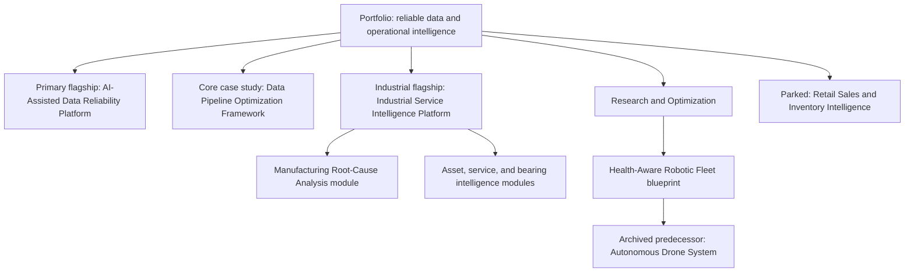

# Portfolio Repository Audit and Restructure Plan

**Audit date:** 2026-07-30<br>
**Scope:** The repository and working tree as found locally. Existing files and GitHub Pages configuration were not changed during the audit.<br>
**Constraint:** Review this plan before changing `_config.yml`, moving content, or removing anything.

## 1. Current repository structure

The repository currently combines a Jekyll portfolio site, a runnable reference implementation, product-foundation notes, project placeholders, and generated/local development artifacts.

```text
/
|-- _config.yml                         # Jekyll/Pages configuration
|-- index.md                            # Current Pages homepage
|-- README.md                           # GitHub repository landing page
|-- 404.html
|-- Gemfile / Gemfile.lock
|-- portfolio_manifest.yaml             # Current project taxonomy and statuses
|-- assets/
|   `-- css/custom.css                  # Present locally, ignored by root .gitignore
|-- docs/
|   |-- portfolio_strategy.md
|   `-- project_readme_template.md
|-- projects/
|   `-- rul-bearing.md                  # Present locally, ignored by root .gitignore
|-- reliabilityos/                      # Untracked product-foundation case study
|   |-- index.md
|   `-- phase-1.md
|-- ai-data-reliability-platform/       # Untracked reference implementation
|   |-- README.md / TASKS.md
|   |-- src/                            # Python implementation
|   |-- tests/                          # Unit and integration tests
|   |-- configs/, data/, sql/
|   |-- airflow/, scripts/, docs/
|   `-- Docker/packaging/CI files
|-- _site/                              # Generated Jekyll output; ignored
|-- .jekyll-cache/                      # Generated cache; ignored
`-- local_ignored/                      # Intentionally local-only content
```

Repository-state observations:

- The tracked site is small: Git currently tracks the root Jekyll files and the two existing `docs/` files, but not `projects/`, `assets/`, `reliabilityos/`, or `ai-data-reliability-platform/`.
- `README.md`, `index.md`, and `portfolio_manifest.yaml` already contain uncommitted user changes. This plan does not overwrite or normalize them.
- The root `.gitignore` ignores `projects/` and `assets/`, so locally visible pages and assets in those directories will not be published unless the ignore policy is deliberately changed later.
- The nested implementation correctly ignores its virtual environment, test caches, coverage files, runtime data, databases, and logs. Those generated files are locally present but should remain unpublished.
- `_config.yml` declares a `projects` collection, but Jekyll collections conventionally read from `_projects/`, not `projects/`. No `_projects/` directory exists, so the collection is currently unused.

## 2. Broken or missing internal links

The following destinations are missing from the current working tree or will be missing from GitHub Pages because they are ignored.

| Source | Link or reference | Finding | Recommended treatment |
|---|---|---|---|
| `README.md` | `projects.md` (three references) | File does not exist and is explicitly ignored. | Replace with a committed `projects/index.md` or create a committed `projects.md`; use one canonical project-index URL. |
| `README.md` and manifest | `projects/Real-Time-Failure.md` | File is absent; `projects/` is ignored. | Create an archived predecessor page with a stable lowercase permalink, then redirect or retain a compatibility stub if the old path was ever public. |
| `README.md` and manifest | `projects/health-aware-robotic-fleet-optimization.md` | File is absent. | Create the research/blueprint project page before linking it. |
| `README.md` and manifest | `projects/manufacturing-root-cause-analysis.md` | File is absent. | Replace the standalone promotion with a module section/link under Industrial Service Intelligence; preserve a legacy page explaining the evolution. |
| `README.md` and manifest | `projects/real-time-constraint-optimization.md` | File is absent. | Do not promote until its relationship to the Data Pipeline Optimization Framework or research track is decided. |
| `index.md` | `/assets/images/profile.jpg` through `relative_url` | Image does not exist; all `assets/` content is ignored. | Add a committed image or remove the image element during the reviewed migration. |
| `_config.yml` | `header_pages: posts.md` | `posts.md` does not exist. The existing local build silently omits it from navigation. | Remove it from navigation or create the page after configuration changes are approved. |
| `portfolio_manifest.yaml` | AI-Assisted Data Reliability Platform has `repo: ""` | A matching implementation directory exists locally, so the catalog does not lead visitors to the strongest evidence. | Set a verified destination after the implementation is committed and publication boundaries are chosen. |

Links verified as locally resolvable include the AI reliability implementation's three documentation links, `reliabilityos/` to `phase-1/`, and the link to `projects/rul-bearing.md` in the working tree. The last of these would still fail for a visitor because the entire directory is ignored by Git.

External URLs were not treated as internal-link findings. They should be checked over HTTP during the validation phase.

## 3. Encoding problems

There are two distinct encoding defects.

1. `_config.yml` uses curly Unicode quotation marks around `baseurl` instead of YAML string delimiters. Jekyll therefore includes the curly quotes in the value. The existing generated HTML confirms URLs such as `/%E2%80%9C/git_portfolio%E2%80%9D/`, which breaks canonical URLs, the theme stylesheet, the feed, the homepage link, and the profile-image URL. The `description` also has mismatched curly quotes and awkward nested quotation.
2. `README.md` contains repeated multi-encoded mojibake where em dashes and middle-dot separators were decoded and re-encoded multiple times. This affects the introduction, Explore navigation, flagship heading, and portfolio-navigation bullets.

`index.md` and `docs/portfolio_strategy.md` contain correctly encoded em dashes in the current working tree. Any repair should be performed file by file as UTF-8, not by a repository-wide replacement, because the mojibake has more than one encoding depth.

## 4. Current project entries and their statuses

The classification below is the required target portfolio truth. “Current evidence found” distinguishes working software, documentation, and missing material so the labels do not overstate maturity.

| Project | Required classification/status | Current evidence found | Current-site conflict or gap |
|---|---|---|---|
| AI-Assisted Data Reliability Platform | **Reference Implementation**; **primary flagship** | Substantial local implementation with Python source, data contracts, CLI/API, orchestration, unit and integration tests, Docker files, CI workflow, PRD, architecture, security, runbook, and scenario documentation. It explicitly limits production-readiness claims. | Root README and manifest call it `Planned` and provide no destination; homepage promotes ReliabilityOS instead. |
| Data Pipeline Optimization Framework | **Active Development**; **core engineering case study** | No entry or dedicated evidence found under this name. A missing “Real-Time Constraint Optimization” page is referenced, but that is not enough to infer equivalence. | Must be created and given an honest initial evidence statement; do not imply implementation until present. |
| Industrial Service Intelligence Platform | **Active Development**; **industrial-domain flagship** | No dedicated entry found. Existing portfolio language covers asset uptime, bearing intelligence, maintenance, and root-cause investigation as separate planned concepts. | Consolidate the relevant narrative and clearly distinguish current artifacts from planned modules. |
| Health-Aware Robotic Fleet Optimization System | **Design / Blueprint** under **Research and Optimization** | Referenced in README/manifest, but its linked page is absent. Manifest currently says `In Development`. | Create the blueprint page and downgrade the evidence label from implementation-oriented wording. |
| Retail Sales and Inventory Intelligence Platform | **Parked** | No entry or evidence found. | Add a concise parked record with reason, known scope, and reactivation criteria; do not feature it. |
| Manufacturing Root-Cause Analysis Assistant | **Evolved into a module of the Industrial Service Intelligence Platform** | Referenced in README/manifest, but its linked page is absent. Manifest currently says `In Development`. | Preserve the name in a legacy/evolution note; direct visitors to the parent platform's module section. |
| Health-Aware Autonomous Drone System | **Archived predecessor** to robotic-fleet research | Promoted as the current flagship and `In Development`, but the linked file is absent. | Remove from featured/current-work positions only after an archive page and replacement links exist. |

Other current entries require an explicit keep/merge decision because they are outside the supplied seven-project classification:

- **ReliabilityOS — Product Foundation:** two coherent documentation pages exist locally, with careful evidence boundaries, but the work competes with the required AI reliability flagship and is untracked. Recommended disposition: preserve as an exploratory product-discovery case study or fold its explainable triage concepts into the AI-Assisted Data Reliability Platform; do not present it as a second flagship.
- **Remaining Useful Life Prediction for Bearings — current direction/brief:** one ignored page exists. Recommended disposition: preserve as research or as a future Industrial Service Intelligence module, with its evidence level labeled “Concept / Plan.”
- **AI Knowledge and Evaluation Platform, Asset Uptime Operations System, Product Event Streaming Platform, Bearing Product Intelligence — Planned:** manifest/README-only roadmap entries. The asset-uptime and bearing-intelligence ideas overlap strongly with Industrial Service Intelligence; consolidate them as modules/capabilities. Park the other ideas in a roadmap unless evidence is added.
- **Real-Time Constraint Optimization for Multi-Stage Workflows — manifest says In Development:** its page is absent. Decide whether it becomes supporting work for the Data Pipeline Optimization Framework; until then, label it as an unverified legacy entry rather than active evidence.

## 5. Duplicate or outdated content

- `README.md`, `index.md`, `portfolio_manifest.yaml`, and `docs/portfolio_strategy.md` each maintain a different project hierarchy. They disagree on the flagship, current work, status vocabulary, and recommended project order.
- `README.md` repeats the project list in a featured table, flagship section, navigation diagram, and navigation bullets. Those copies already contradict the implementation present in the repository.
- The “AI-Assisted Data Reliability Platform” and `ReliabilityOS` overlap around data reliability, incident prioritization, evidence, and human-controlled actions. They should have a declared parent/child or discovery/implementation relationship rather than read as unrelated products.
- “Asset Uptime Operations System,” “Bearing Product Intelligence,” “Manufacturing Root Cause Analysis Assistant,” and bearing RUL work are fragmented expressions of the industrial intelligence theme. The target Industrial Service Intelligence Platform should provide the umbrella narrative.
- “Health-Aware Autonomous Drone System” and robotic-fleet optimization represent predecessor/successor work but are currently listed as peer projects, with the predecessor incorrectly featured.
- The strategy's allowed statuses (`Implemented`, `In Development`, `Architecture Complete`, `Planned`) do not cover `Reference Implementation`, `Design / Blueprint`, `Parked`, `Archived`, or `Evolved into module`. The evidence model must be updated before the project catalog can be consistent.
- `docs/project_readme_template.md` uses the old status vocabulary and should eventually use the shared evidence model.
- The current homepage is a general personal introduction and promotes ReliabilityOS. It does not explain the required four portfolio themes, how the projects connect, or the primary next action.

## 6. Recommended target structure

Use one data-backed catalog and stable public project pages. Keep runnable source code where it is until a separate-repository decision is made.

```text
/
|-- index.md                              # Portfolio homepage
|-- README.md                             # Concise repository entry point
|-- _config.yml                           # Change only after plan review
|-- _data/
|   `-- projects.yml                      # One canonical catalog/status/evidence source
|-- projects/
|   |-- index.md                          # All projects, grouped by portfolio role
|   |-- ai-assisted-data-reliability.md
|   |-- data-pipeline-optimization.md
|   |-- industrial-service-intelligence.md
|   |-- research/
|   |   `-- health-aware-robotic-fleet.md
|   |-- parked/
|   |   `-- retail-sales-inventory.md
|   `-- archive/
|       |-- health-aware-autonomous-drone.md
|       `-- manufacturing-root-cause-assistant.md
|-- docs/
|   |-- portfolio-strategy.md
|   |-- evidence-levels.md
|   |-- project-readme-template.md
|   `-- portfolio-restructure-plan.md
|-- assets/
|   |-- css/custom.css
|   `-- images/                           # Only verified, licensed assets
|-- ai-data-reliability-platform/         # Flagship implementation evidence
|-- reliabilityos/                        # Preserved discovery case study or legacy content
`-- archive/                              # Original source material not suitable as Pages pages
```

Recommended portfolio relationships:



Each public project page should answer the same questions: why it exists, its portfolio role, present evidence level, problem and users, architecture or approach, evidence available now, limitations, relationship to other projects, and the single best next link (code, design, demo, or parent project).

## 7. Files to create, update, move, or preserve

### Create

- `_data/projects.yml` as the canonical catalog, or deliberately evolve `portfolio_manifest.yaml` into that role if avoiding two sources is preferred.
- `projects/index.md` and the seven classified project pages shown in the target structure.
- `docs/evidence-levels.md` defining at least Reference Implementation, Active Development, Design / Blueprint, Parked, Archived, and Evolved/Module.
- Optional compatibility pages or redirects for previously published mixed-case/missing paths after public URL history is checked.
- `assets/images/profile.jpg` only if a suitable image is intentionally part of the homepage.

### Update after review

- `index.md`: replace the generic introduction with the proposed information architecture below.
- `README.md`: remove mojibake, broken links, repeated catalogs, and obsolete flagship language; point to the site and primary evidence.
- `portfolio_manifest.yaml`: reconcile or retire it only after a canonical source is selected.
- `docs/portfolio_strategy.md`: align its pin order, taxonomy, evidence levels, and recruiter journey with the required classification.
- `docs/project_readme_template.md`: adopt the shared evidence labels and add “relationship to portfolio” and “what is evidenced now.”
- `.gitignore`: narrowly unignore the public `projects/` and `assets/` paths while continuing to ignore generated/local content.
- `_config.yml`: fix quoting/base URL, remove or create missing navigation pages, decide whether to use a Jekyll collection, and explicitly exclude development artifacts if needed. This file must not change before audit approval.
- `404.html`: optionally add links back to Home and Projects.
- `ai-data-reliability-platform/README.md`: add a link back to the portfolio page and keep its honest reference-implementation limitations.
- `reliabilityos/index.md`: declare its relationship to the implemented flagship if retained publicly.

### Move or provide compatibility paths after review

- Move the public bearing RUL brief into the Industrial Service Intelligence or Research grouping, preserving its old permalink if it has been published.
- Move predecessor and evolved-project narratives under `projects/archive/`; preserve old URLs with front-matter redirects or small compatibility pages rather than deleting them.
- Move purely local source material to the already ignored `local_ignored/` only when its public replacement has been verified.

### Preserve

- All existing content through the migration; no deletion is required.
- The AI reliability source, tests, documentation, Docker/CI configuration, and explicit production limitations.
- ReliabilityOS evidence-boundary language and phase notes, even if later reframed as discovery history.
- Root license, Gem dependencies, 404 page, and working external contact links unless separately reviewed.
- Generated `_site/`, `.jekyll-cache/`, virtual environments, test caches, runtime data, and secrets as local/ignored artifacts rather than portfolio evidence.

## 8. Safe phased migration plan

### Phase 0 — Review and baseline

1. Review and approve this plan and the treatment of the extra legacy/roadmap entries.
2. Record a clean baseline of Git status and preserve all current user changes.
3. Confirm the GitHub Pages publishing source (branch and folder), repository-name casing, and whether old project URLs have public traffic.
4. Do not change `_config.yml` in this phase.

### Phase 1 — Establish portfolio truth without moving content

1. Define the shared evidence/status vocabulary.
2. Create the canonical project catalog with the required seven classifications.
3. Create project summary pages at their intended final permalinks, initially linking to existing evidence in place.
4. Create the project index and validate every new relative link locally.

### Phase 2 — Align entry points

1. Rewrite `index.md` around the primary flagship, two active case-study paths, research, and parked/archive context.
2. Reduce `README.md` to a consistent GitHub entry point.
3. Update strategy/template documentation and eliminate hand-maintained duplicate status lists where data-driven rendering is practical.
4. Reclassify ReliabilityOS and other out-of-scope roadmap entries without deleting their content.

### Phase 3 — Make public paths publishable

1. Narrow the root ignore rules so approved Pages content and assets are tracked.
2. Add the missing image or remove the image dependency.
3. Commit public pages and assets before changing links that depend on them.
4. Add compatibility pages/redirects for any known old URLs.

### Phase 4 — Configuration correction (approval gate)

1. Fix `_config.yml` quoting and `baseurl` only after confirming the actual Pages URL.
2. Choose either ordinary pages in `projects/` or a real `_projects/` Jekyll collection; do not keep a misleading unused collection.
3. Correct `header_pages` and add intentional navigation.
4. Add explicit Jekyll exclusions if the implementation remains inside the Pages source.

### Phase 5 — Move and consolidate

1. Move predecessor/evolved content to archive locations while retaining stable permalinks.
2. Consolidate industrial subprojects under the Industrial Service Intelligence narrative.
3. Connect ReliabilityOS discovery evidence to the implemented reliability flagship or label it clearly as a separate historical case study.
4. Keep original material until the replacement pages and redirects pass validation.

### Phase 6 — Publish and observe

1. Build in a clean environment, inspect output, and deploy through the existing Pages workflow.
2. Run link and HTML checks against the deployed base URL.
3. Check GitHub Pages build logs and browser console/network failures.
4. Retain a rollback commit or branch until all critical routes are verified.

## 9. GitHub Pages risks and validation steps

| Risk | Current evidence | Validation or mitigation |
|---|---|---|
| Broken `baseurl` | Existing `_site/index.html` contains percent-encoded curly quotes in canonical, CSS, feed, home, and image URLs. | Confirm exact published URL, use plain YAML quotes, build cleanly, and assert no `%E2%80%9C`/`%E2%80%9D` occurs in output. |
| Missing public content due to `.gitignore` | `projects/` and `assets/` are ignored. | Use `git check-ignore -v` on every intended public page/asset and confirm it appears in `git ls-files` before publishing. |
| Broken promoted links | Multiple README destinations are absent. | Run a Markdown link checker over tracked source and an HTML link checker over generated `_site`. Treat case sensitivity as an error. |
| Windows/Linux case differences | `Real-Time-Failure.md` uses mixed case and is absent locally; GitHub Pages runs on a case-sensitive environment. | Standardize lowercase paths and test inside the Pages build environment. Preserve an old permalink if required. |
| Missing profile image | `index.md` references a nonexistent ignored asset. | Verify the generated image URL returns 200, has alt text, and does not cause layout shift; otherwise remove it. |
| Navigation references missing page | `posts.md` is configured but absent. | Ensure each `header_pages` entry exists and is emitted in the clean build. |
| Unused/misconfigured collection | `collections.projects` has no `_projects/` source. | Select one content model and verify generated routes from the build manifest/output. |
| Nested project files leaking into the site | The implementation is inside the Pages source tree. | Inspect generated file inventory; add explicit Jekyll exclusions later for environments, caches, runtime data, configs, or source files that should not be published. Never publish `.env` or runtime metadata. |
| Unsupported Pages dependencies | Local Gem versions may differ from GitHub Pages. | Run the same build mode used by Pages, check dependency compatibility, and review the Pages build log. |
| Stale generated output | `_site/` predates current working-tree changes and is ignored. | Delete/rebuild only in a controlled validation step or build to a clean temporary destination; never use the current `_site/` as proof of the new site. |
| YAML/catalog drift | Four files currently duplicate project truth. | Parse the canonical catalog during CI and validate required keys, allowed statuses, unique slugs, and existing destinations. |
| Mermaid rendering differences | GitHub README supports Mermaid; the Minima/Jekyll site may not render fenced Mermaid diagrams without support. | Inspect the deployed page in a browser; replace critical diagrams with accessible HTML/SVG or add reviewed rendering support. |
| Raw implementation size/noise | A complete reference implementation is currently untracked inside the site repository. | Decide whether it belongs in this repository or a dedicated project repository; if retained, keep generated artifacts ignored and exclude non-site paths from Jekyll output. |

Minimum validation checklist before publication:

1. `bundle exec jekyll build` succeeds from a clean checkout using the intended Pages configuration.
2. No generated URL contains encoded curly quotes, duplicated base paths, backslashes, or local filesystem paths.
3. Home, Projects, all seven classified pages, archive/evolution links, stylesheet, image (if retained), feed, and 404 page return the expected result under the repository base path.
4. Every internal Markdown/HTML link resolves with exact filename case.
5. The generated site contains no `.env`, virtual environment, cache, coverage, runtime data, database, log, or local-only file.
6. The homepage, README, catalog, and individual pages show the same status for every project.
7. Reference Implementation and Active Development pages expose evidence and limitations; Design, Parked, and Archived pages do not imply working software.
8. Test on desktop and mobile widths, keyboard navigation, meaningful heading order, alt text, and color contrast.
9. Verify the deployed URL, canonical tags, feed URL, repository links, LinkedIn, email, and GitHub links.
10. Review the GitHub Pages build/deployment log before declaring the migration complete.

## 10. Proposed homepage information architecture

The homepage should answer, in order: who this portfolio is for, what the strongest evidence is, how the work connects, what is active now, and where the visitor should go next.

### 1. Hero and positioning

- Name and concise role: data engineering, industrial intelligence, AI data systems, and optimization.
- One outcome-oriented sentence connecting reliable data foundations to operational decisions.
- Primary call to action: **Explore the AI-Assisted Data Reliability reference implementation**.
- Secondary call to action: **View all projects and evidence levels**.

### 2. Primary flagship

- AI-Assisted Data Reliability Platform.
- Badge: **Reference Implementation**.
- State the problem, what runs now, the strongest evidence (source, tests, scenarios, guarded agent workflow), and explicit non-production boundary.
- Next links: overview, code, architecture, demo/run instructions, and tests.

### 3. Active engineering case studies

Two equal but clearly differentiated cards:

- **Data Pipeline Optimization Framework — Active Development:** core engineering, performance/reliability problem, current milestone, current evidence, next milestone.
- **Industrial Service Intelligence Platform — Active Development:** industrial-domain flagship, service/maintenance decision problem, current modules, current evidence, next milestone.

### 4. How the projects connect

Use a compact flow showing shared foundations rather than a list of unrelated ideas:

`Reliable ingestion and contracts -> observable/optimized pipelines -> trustworthy AI-assisted analysis -> industrial and operational decisions`, with research exploring optimization under health constraints.

### 5. Research and optimization

- Health-Aware Robotic Fleet Optimization System.
- Badge: **Design / Blueprint**.
- Explain research questions, constraints, artifacts available, and the archived drone predecessor.

### 6. Project lifecycle and evidence guide

Brief definitions for Reference Implementation, Active Development, Design / Blueprint, Parked, Archived, and Evolved into Module. Link to the full evidence policy. This makes status labels useful rather than decorative.

### 7. Complete portfolio map

- Active and flagship projects first.
- Parked: Retail Sales and Inventory Intelligence Platform, with no prominent call to action.
- Evolved: Manufacturing Root-Cause Analysis Assistant, linked to its Industrial Service Intelligence module.
- Archived: Health-Aware Autonomous Drone System, linked as research history.
- Additional legacy/concept work grouped separately and not mixed into the flagship list.

### 8. Engineering approach

Summarize the repeatable approach already present in the repository: problem and constraints, data/system design, quality and observability, evidence, safe AI assistance, and accountable human action.

### 9. About and contact

- Short professional background, with mechanical/manufacturing experience framed as an industrial-domain advantage.
- GitHub, LinkedIn, and email.
- Final call to action should route technical visitors to the flagship evidence and other visitors to the project index.

The first viewport should not lead with biography, a parked/archived idea, or an unimplemented concept. It should lead with the portfolio thesis and the strongest verifiable engineering evidence.
