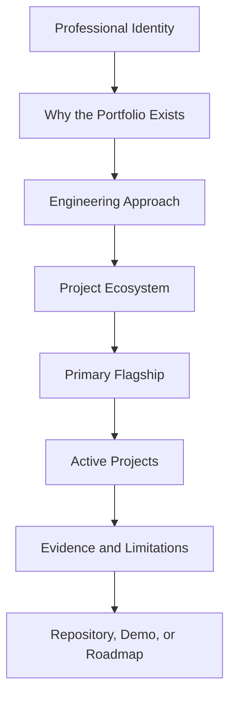

# Portfolio Strategy

## Primary Identity

**Data Engineer | Reliable Data Platforms | AI-Ready Data Systems | Applied Operational Intelligence**

The portfolio connects data engineering with manufacturing and process-engineering domain knowledge. Industrial experience provides context for assets, service, maintenance, quality, reliability, constraints, and physical operations; it does not replace the primary Data Engineer identity.

## Portfolio Mission

Build reliable, observable, and AI-ready data systems that transform raw operational and business data into trusted data products, measurable workflows, and human-controlled decision support.

## Priority Order

1. **AI-Assisted Data Reliability Platform** - primary flagship and Reference Implementation.
2. **Data Pipeline Optimization Framework** - core engineering case study in Active Development.
3. **Industrial Service Intelligence Platform** - industrial-domain flagship in Active Development.
4. **Health-Aware Robotic Fleet Optimization System** - Design / Blueprint research track.
5. **Retail Sales and Inventory Intelligence Platform** - Parked domain-transfer project.

The Manufacturing Root-Cause Analysis Assistant is evolving into a module of the Industrial Service Intelligence Platform. The Health-Aware Autonomous Drone System is an archived predecessor to robotic-fleet research.

## Evidence Status Rules

- **Reference Implementation:** runs locally with documented behavior, tests, and limitations.
- **Active Development:** working implementation exists, but significant milestones remain.
- **Design / Blueprint:** architecture and requirements exist, while implementation is limited.
- **Planned:** approved future work that has not started meaningfully.
- **Parked:** intentionally paused.
- **Evolving:** the concept is being incorporated into another project.
- **Archived / Evolved:** no longer independently active; the concept moved into broader work.

A project brief is never evidence of a completed implementation. Performance, production deployment, scale, and business impact are stated only when supported by reproducible evidence.

## Visitor Journey

## Maintenance Rules

1. Keep `_data/projects.yml` as the canonical website catalog.
2. Keep the homepage, README, and compatibility manifest aligned with the catalog.
3. Confirm every internal link and exact filename case before publishing.
4. Use browser repository URLs without a `.git` suffix.
5. Keep planned work separate from working evidence.
6. State AI tool boundaries and the accountable human role.
7. Preserve archived and evolved work without featuring it as current implementation.
