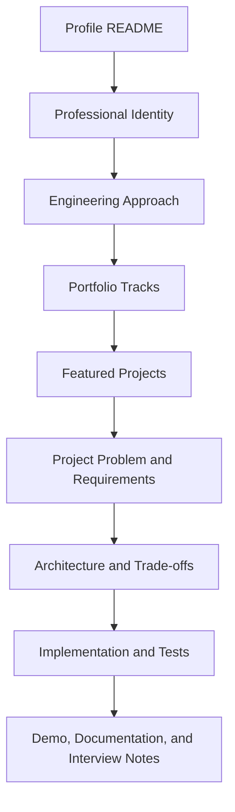

# Portfolio Strategy

## Primary identity

Data Engineer

## Portfolio message

> I design reliable data platforms that support analytics and AI applications, and I apply those systems to real business and operational problems.

Mechanical and manufacturing experience is a domain advantage for understanding assets, maintenance, operations, reliability, and physical constraints—not a competing professional identity.

## Repository strategy

- Use one personal GitHub account.
- Use the profile README as the entry point when a profile repository is available; until then, use this repository README.
- Use separate repositories for serious projects once they contain meaningful implementation evidence.
- Pin only four to six strong projects.
- Do not pin empty frameworks, tutorial clones, or nearly identical dashboards.
- Use honest status labels: `Implemented`, `In Development`, `Architecture Complete`, or `Planned`.
- Keep future ideas in the manifest or roadmap instead of creating many empty repositories.
- Link only public, verified destinations.
- Treat AI output as evidence preparation or recommendation and identify the person accountable for action.

## Recommended pin order

1. AI-Assisted Data Reliability Platform
2. AI Knowledge and Evaluation Platform
3. Asset Uptime Operations System
4. Product Event Streaming Platform
5. Bearing Product Intelligence
6. Portfolio website or one polished contribution

This is a target order, not a claim that these repositories exist. Pin a project only after its repository demonstrates its status.

## Recruiter journey

## Status evidence rules

- **Implemented:** runnable implementation, instructions, and proportionate tests are present.
- **In Development:** active design or partial implementation is present, with missing work stated.
- **Architecture Complete:** requirements, alternatives, design, boundaries, and diagrams are complete; implementation is not implied.
- **Planned:** roadmap only; no repository link is required.

The tracked project pages are briefs or development plans, so none are labelled `Implemented`.

## Maintenance checklist

1. Confirm every relative link resolves.
2. Compare status labels with repository evidence.
3. Remove unsupported scale, deployment, impact, or savings claims.
4. Keep the first screen focused on Data Engineering identity and outcomes.
5. Keep planned work visibly separate from documented work.
6. State AI guardrails and the human responsibility boundary.
7. Update the manifest and landing-page table together.
