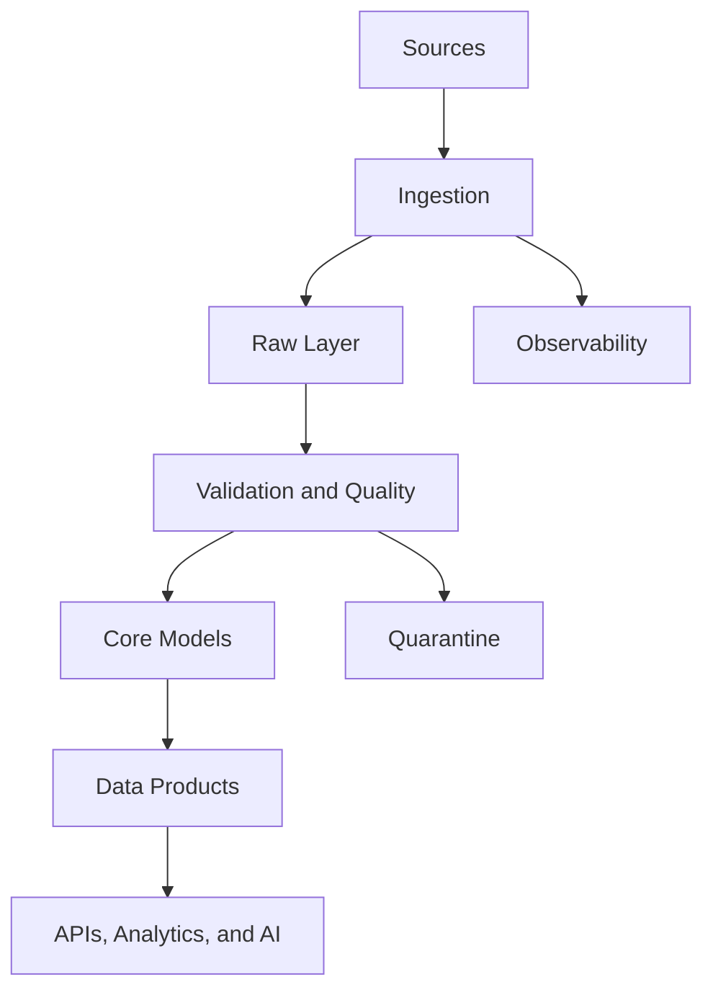

# [Project title]

**Status:** [Implemented | In Development | Architecture Complete | Planned]

## 1. Executive summary

[Explain the problem, system, present evidence, and outcome in three to five lines.]

## 2. Problem I am solving

[State the concrete user or operational problem.]

## 3. Why the problem matters

[Describe the business, reliability, safety, or user impact without unsupported numbers.]

## 4. Users and stakeholders

[List users, operators, approvers, owners, and affected groups.]

## 5. Business and technical requirements

[Separate measurable business requirements from technical requirements.]

## 6. Constraints and assumptions

[Document data, latency, cost, security, staffing, and domain constraints. Label assumptions.]

## 7. First-principles thought process

```mermaid
flowchart LR
    A[Problem] --> B[Business Impact]
    B --> C[Requirements]
    C --> D[Constraints]
    D --> E[Architecture Options]
    E --> F[Chosen Design]
    F --> G[Implementation]
    G --> H[Reliability and Testing]
    H --> I[AI Assistance]
    I --> J[Human Decision Boundary]
    J --> K[Outcome]
```



[Explain the decomposition and which facts drove the design.]

## 8. Architecture alternatives considered

| Alternative | Advantages | Disadvantages | Decision |
|---|---|---|---|
| [Option] | [Advantages] | [Disadvantages] | [Selected or rejected, with reason] |

## 9. Chosen architecture and justification

[Connect every major choice to a requirement or constraint.]

## 10. System context diagram

[Show users, upstream systems, the project boundary, and downstream consumers.]

## 11. End-to-end data workflow



[Explain the happy path, decision points, and side outputs.]

## 12. Data sources

| Source | Format and cadence | Owner | Known limitations |
|---|---|---|---|
| [Source] | [Format/cadence] | [Owner] | [Limitations] |

## 13. Data model

[Describe entities, grains, keys, history, and relationships.]

## 14. Data contracts

[Define schema, required fields, semantics, freshness, compatibility, and ownership.]

## 15. Data quality and reconciliation

[Document rules, quarantine behavior, source-to-target checks, and thresholds.]

## 16. Failure modes

| Failure | Detection | Effect | Mitigation |
|---|---|---|---|
| [Failure] | [Signal] | [Effect] | [Mitigation] |

## 17. Recovery and backfill strategy

[Explain retry safety, idempotency, checkpoints, replay, isolation, and approvals.]

## 18. Observability and SLOs

[State signals, owners, alerts, dashboards, and justified SLOs.]

## 19. Security and governance

[Cover access, secrets, sensitive data, retention, lineage, auditability, and compliance assumptions.]

## 20. AI component

[State the task, inputs, outputs, evaluation data, versioning, guardrails, and fallback. Write “Not applicable” when appropriate.]

## 21. Human responsibility boundary

[Name decisions a person must review or approve and identify the accountable role.]

## 22. Testing strategy

[Cover unit, contract, integration, data-quality, recovery, performance, and AI evaluation tests.]

## 23. CI/CD and deployment

[Describe checks, artifacts, environments, migrations, release controls, and rollback.]

## 24. Cost and scalability

[Identify cost drivers, assumptions, bottlenecks, scaling options, and measurement gaps.]

## 25. Implementation status

- Completed: [Link evidence]
- In progress: [Current work]
- Planned: [Future work]
- Not implemented: [Absent features]

## 26. Repository structure

```text
.
├── README.md
├── src/
├── tests/
└── docs/
```

[Replace this placeholder with the actual structure.]

## 27. How to run

[List verified prerequisites and reproducible setup, test, and run commands.]

## 28. Business or economic outcome

[State measured evidence. If unmeasured, label the expected benefit as a hypothesis.]

## 29. Trade-offs and limitations

[Explain compromises, failure boundaries, and unvalidated claims.]

## 30. Future production version

[Describe required changes without presenting them as current features.]

## 31. Project explanation

[Prepare a concise problem → constraints → design → reliability → trade-offs → outcome narrative.]

## 32. Evidence summary

- [Action + system + engineering method + verified result or status]
- [Reliability, quality, or governance evidence]
- [Business/domain connection without unsupported impact]

## 33. References

[Optional datasets, standards, papers, and official documentation.]
