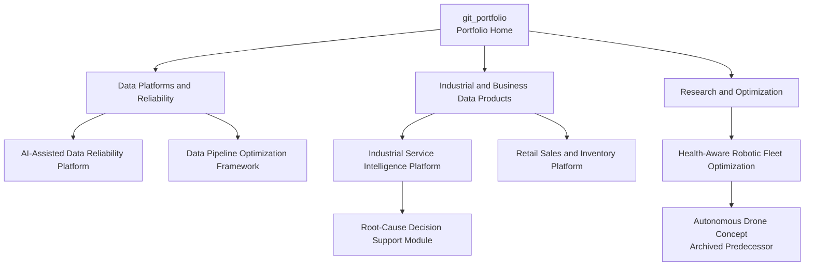

The repositories are independent portfolio projects that share engineering patterns. They are not presented as one deployed, integrated system.

## Shared Patterns

- **Reliability foundation:** ingestion, contracts, validation, quarantine, reconciliation, observability, incident evidence, idempotency, and controlled recovery.
- **Performance engineering:** baselines, incremental processing, suitable storage formats, partitioning, runtime monitoring, correctness checks, and reproducible comparisons.
- **Operational data products:** domain models and trusted KPIs that connect technical behavior with service, reliability, cost, and customer outcomes.
- **Responsible AI assistance:** evidence collection, retrieval, summaries, structured recommendations, bounded tools, deterministic fallbacks, and approval gates.
- **Optimization:** explicit objectives, constraints, feasible baselines, simulations, scheduling, routing, and measurable fleet or workflow outcomes.

## Project Relationships

The [AI-Assisted Data Reliability Platform](https://github.com/SouravKh-7/ai-data-reliability-platform) demonstrates reusable reliability and incident-response patterns. The [Data Pipeline Optimization Framework](https://github.com/SouravKh-7/data-pipeline-optimization-framework) demonstrates how performance changes should be measured without sacrificing correctness.

The [Industrial Service Intelligence Platform](https://github.com/SouravKh-7/industrial-service-intelligence-platform) applies data engineering to machine and after-sales operations. The earlier [Manufacturing Root-Cause Analysis Assistant](https://github.com/SouravKh-7/Manufacturing-Root-Cause-Analysis-Assistant) is being consolidated into it as a traceable decision-support module.

The [Health-Aware Robotic Fleet Optimization System](https://github.com/SouravKh-7/Health-Aware-Robotic-Fleet-Optimization-System) explores optimization and intelligent operations. The [Health-Aware Autonomous Drone System](https://github.com/SouravKh-7/Health-Aware-Autonomous-Drone-System) is retained as its archived conceptual predecessor.

The [Retail Sales and Inventory Intelligence Platform](https://github.com/SouravKh-7/Retail-Sales-and-Inventory-Intelligence-Platform) is intentionally parked. It may later test whether the same data-product and decision-support patterns transfer cleanly to another domain.
