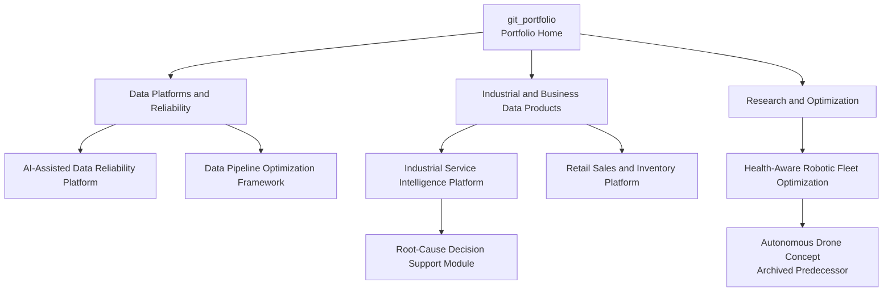

# Sourav Khandai

## Data Engineer | Reliable Data Platforms | AI-Ready Data Systems | Applied Operational Intelligence

I design reliable data systems that turn business and operational requirements into tested pipelines, trusted data products, AI-ready datasets, measurable workflows, and human-controlled automation.

My primary direction is Data Engineering, including pipeline development, data quality, reliability, platform design, APIs, DevOps, observability, and AI-assisted engineering workflows. My manufacturing and process-engineering background provides domain knowledge in assets, maintenance, service operations, quality, reliability, and physical systems.

[Explore the primary flagship](https://github.com/SouravKh-7/ai-data-reliability-platform) | [View all projects]({{ '/projects/' | relative_url }})

## Why This Portfolio Exists

Modern data and operational systems require more than isolated pipelines or machine-learning models. They require reliable ingestion, validated and traceable data, measurable processing, domain-aware analytics, operational monitoring, and carefully controlled decision-support workflows.

This portfolio is my long-term engineering program for studying and building those connected layers. Each repository focuses on a specific problem: data reliability, pipeline optimization, industrial service intelligence, business data products, or operations optimization.

Together, the projects demonstrate how raw operational data can be transformed into trustworthy data products and human-controlled intelligent systems. The projects are intentionally developed in stages, beginning with deterministic data and software foundations before introducing analytics, machine learning, retrieval systems, or AI-assisted workflows.

## Engineering Approach

Deterministic engineering comes first: data must be validated, traceable, and observable before higher-level automation can be trusted. AI may collect evidence, summarize findings, recommend options, or prepare actions. High-risk operational actions require human approval, and AI does not bypass accountability.

## Project Ecosystem

The reliability platform demonstrates reusable data-quality and incident-response patterns. Pipeline optimization focuses on measurable performance engineering. Industrial Service Intelligence applies data engineering to a real operational domain, with the earlier root-cause assistant becoming one of its decision-support modules. The robotic fleet project explores optimization and intelligent operations; its drone predecessor remains available as research history. The retail project is parked until the core projects have stronger evidence.

[Read the full ecosystem explanation]({{ '/ecosystem/' | relative_url }})

## Primary Flagship

### [AI-Assisted Data Reliability Platform](https://github.com/SouravKh-7/ai-data-reliability-platform)

**Status:** Reference Implementation 
**Problem:** Data pipelines can complete successfully while producing stale, incomplete, invalid, or unreconciled data that affects reports and AI applications. 
**Current evidence:** A production-style local reference implementation covering ingestion, data contracts, validation, quarantine, transformations, reconciliation, incident detection, business-impact analysis, FastAPI, tests, Docker, CI/CD, and guarded incident response. 
**Technology focus:** Python, Pandas, PyArrow, Parquet, DuckDB, FastAPI, Pydantic, PostgreSQL, Pytest, Docker, and GitHub Actions. 
**Next milestone:** Strengthen reproducibility, operational metadata, observability, and documented evidence.

This is a local reference implementation, not a deployed production system.

## Featured Active Projects

### [Data Pipeline Optimization Framework](https://github.com/SouravKh-7/data-pipeline-optimization-framework)

**Status:** Active Development 
**Problem:** Pipeline improvements are difficult to evaluate without a reproducible baseline, correctness checks, and comparable measurements. 
**Current evidence:** An active engineering case study intended to compare an inefficient baseline with incremental loading, Parquet, partitioning, data quality, reconciliation, and runtime monitoring. 
**Technology focus:** Python, SQL, Parquet, incremental processing, partitioning, validation, reconciliation, and benchmarking. 
**Next milestone:** Publish reproducible before-and-after benchmarks. No performance improvement is claimed until measured results are available.

### [Industrial Service Intelligence Platform](https://github.com/SouravKh-7/industrial-service-intelligence-platform)

**Status:** Active Development 
**Problem:** Machine, service, warranty, maintenance, customer, dealer, and spare-part data are often fragmented across operational processes. 
**Current evidence:** Active platform development with completed, in-progress, and planned capabilities documented separately in its repository. 
**Technology focus:** Industrial data modeling, ingestion, quality controls, service KPIs, reliability analysis, APIs, and decision-support outputs. 
**Next milestone:** Complete and document the MVP, then integrate the root-cause decision-support module.

## Research and Optimization

### [Health-Aware Robotic Fleet Optimization System](https://github.com/SouravKh-7/Health-Aware-Robotic-Fleet-Optimization-System)

**Status:** Design / Blueprint

This research project explores health-aware task assignment, robot availability, battery state, load capacity, route planning, conflict avoidance, telemetry, scheduling, simulation, and fleet-level optimization. Its current classification reflects architecture and requirements work; it is not presented as a completed Industrial AI system.

## Parked and Evolved Projects

- **[Retail Sales and Inventory Intelligence Platform](https://github.com/SouravKh-7/Retail-Sales-and-Inventory-Intelligence-Platform) - Parked:** a future domain-transfer project, intentionally paused until the core portfolio is stronger.
- **[Manufacturing Root-Cause Analysis Assistant](https://github.com/SouravKh-7/Manufacturing-Root-Cause-Analysis-Assistant) - Evolving:** an earlier RAG and decision-support concept being consolidated into the [Industrial Service Intelligence Platform](https://github.com/SouravKh-7/industrial-service-intelligence-platform).
- **[Health-Aware Autonomous Drone System](https://github.com/SouravKh-7/Health-Aware-Autonomous-Drone-System) - Archived / Evolved:** the historical concept that led to the broader [robotic fleet optimization research](https://github.com/SouravKh-7/Health-Aware-Robotic-Fleet-Optimization-System).

## Status Guide

- **Reference Implementation** - runs locally with documented behavior, tests, and limitations.
- **Active Development** - working implementation exists, but significant milestones remain.
- **Design / Blueprint** - architecture and requirements exist, while implementation is limited.
- **Planned** - approved future work that has not started meaningfully.
- **Parked** - intentionally paused.
- **Evolving** - the concept is being incorporated into another project.
- **Archived / Evolved** - no longer independently active; the concept moved into broader work.

## Current Roadmap

- **Primary flagship:** AI-Assisted Data Reliability Platform.
- **Current engineering focus:** strengthening reproducibility, testing, observability, documentation, and evidence across the data-engineering portfolio.
- **Next major build:** measurable pipeline optimization results and the Industrial Service Intelligence MVP.
- **Research track:** health-aware robotic fleet scheduling and optimization.

[View the implementation roadmap]({{ '/roadmap/' | relative_url }})

## Engineering Capabilities

### Data Engineering

Python, SQL, Pandas, Parquet, PyArrow, DuckDB, PostgreSQL, ETL/ELT, dimensional modeling, batch processing, incremental processing, CDC concepts, APIs, and data products.

### Data Reliability and Platform Engineering

Data contracts, schema validation, business-rule checks, quarantine, reconciliation, freshness, observability, incident evidence, idempotency, testing, Docker, CI/CD, and operational runbooks.

### AI Data Systems

RAG ingestion, document metadata, retrieval evaluation, structured outputs, agent tool boundaries, deterministic fallbacks, guardrails, approval workflows, and human-in-the-loop systems.

### Industrial and Operational Intelligence

Assets, maintenance, service operations, warranty, spare parts, manufacturing quality, reliability, operational KPIs, business-impact analysis, and decision support.

### Optimization and Systems Thinking

Scheduling, task assignment, constraint modeling, route planning, simulation, fleet metrics, resource allocation, and operations research.

These capabilities combine working knowledge with an active learning roadmap. They are not claims that every technique has been deployed in production.

## Contact

- [GitHub](https://github.com/SouravKh-7)
- [LinkedIn](https://www.linkedin.com/in/sourav-khandai-75022b144/)
- [Email](mailto:khandai.sourav111@gmail.com)
